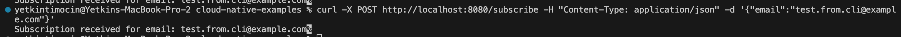
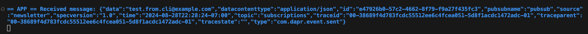

# Newsletter

There are two applications here:

1. Newsletter App: With only one POST endpoint where users can subscribe to a newsletter.
2. Consumer App: When there is a new subscriber, the email is written to a pubsub topic. Consumer app consumes the message from the pubsub.

## Dapr Components Used

- **pubsub.redis**
- **bindings.postgres** (Should this be a separate section?)

## Dapr Subscriptions Used

- subscription of **Consumer App** to the **pubsub.redis**

## Run locally

- `./run.sh`
- You can also run `dapr dashboard` to see the running applications.

## Test locally

- `curl -X POST http://localhost:8080/subscribe -H "Content-Type: application/json" -d '{"email":"test.from.cli@example.com"}'`

## Test outputs

### From the Newsletter App (Producer)

### From the Newsletter App (Consumer)

## References
