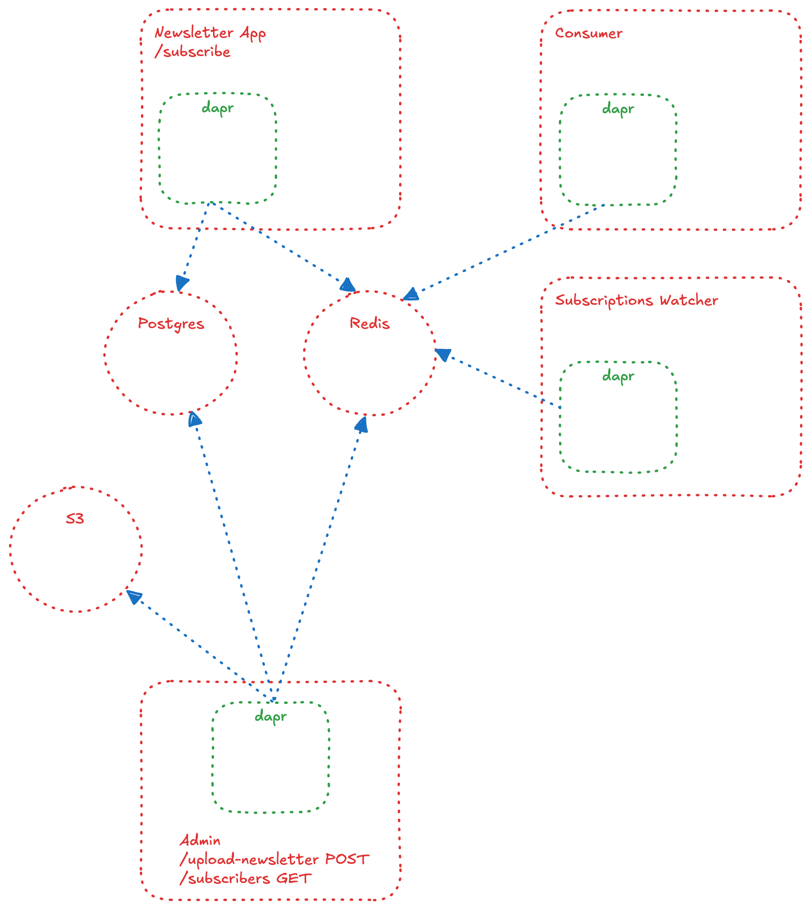

# Newsletter

## Architecture

### Services

There are 4 micro-services here:

1. Newsletter App: With only one POST endpoint where users can subscribe to a newsletter.
2. Consumer App: When there is a new subscriber, the email is written to a pubsub topic. Consumer app consumes the message from the pubsub.
3. Subscriptions Watcher App: Another consumer application configured via Beans. This app also consumes messages from the configured pubsub.
4. Newsletter Admin App: An app where the admin can see the list of subscribers (WIP), upload files (newsletters) to S3. The upload process also sends a message to the uploads topic in the Redis which will be picked up by one of the consumers to send the uploaded file to the subscribers.

### Diagram

### Dapr Components Used

- **pubsub.redis**
- **bindings.postgres**
- **bindings.aws.s3**

### Dapr Subscriptions Used

- subscription of **Consumer App** to the **pubsub.redis**

## Local Postgres, Redis, and S3

Please see docker-compose.yml file for details.

### S3

- S3: `brew install localstack/tap/localstack-cli`. Localstack: <https://docs.localstack.cloud/getting-started/installation/>.
- `pip install awscli-local`
- `awslocal s3api create-bucket --bucket sample-bucket`
- `awslocal s3api list-objects --bucket sample-bucket`

## Run locally (Not on a Kubernetes cluster)

- `docker compose up`
- `./run.sh`
- You can also run `dapr dashboard` to see the running applications. There should be 4 applications on the dashboard.
- List all applications `dapr list`
- To stop an application `dapr stop --app-id app-name`

## Test locally (Not on a Kubernetes cluster)

- `curl -X POST http://localhost:8080/subscribe -H "Content-Type: application/json" -d '{"email":"test.from.cli@example.com"}'`
- `curl -X POST http://localhost:3001/upload -F "file=@example.txt"`

## References

- <https://docs.localstack.cloud/user-guide/aws/s3/>
