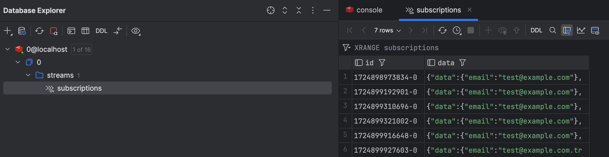

# Newsletter App (Java Spring)

## Postgres & Redis

- `docker run --name newsletter-db -e POSTGRES_USER=adminuser -e POSTGRES_PASSWORD=adminpass -e POSTGRES_DB=newsletter -p 5433:5432 -d postgres`
- `docker run --name newsletter-redis -p 6380:6379 -d redis`
- Create the table:

  ```sql
  CREATE TABLE subscriptions (
    id SERIAL PRIMARY KEY,
    email VARCHAR(255) NOT NULL,
    created_at TIMESTAMP DEFAULT CURRENT_TIMESTAMP
  );
  ```

## Steps

- `mvn clean install`
- `mvn spring-boot:run`
- `curl -X POST http://localhost:8080/subscribe -H "Content-Type: application/json" -d '{"email":"test@example.com"}'`

## Run the app with Dapr

- `mvn clean package`
- `dapr run --app-id newsletter --app-port 8080 --dapr-http-port 3500 --resources-path dapr/components -- java -jar target/newsletter-0.0.1-SNAPSHOT.jar`

## Test

- `curl -X POST http://localhost:8080/subscribe -H "Content-Type: application/json" -d '{"email":"test@example.com"}'`
- The response should be: `Subscription received for email: test@example.com`
- Check Postgres
- Check Redis


